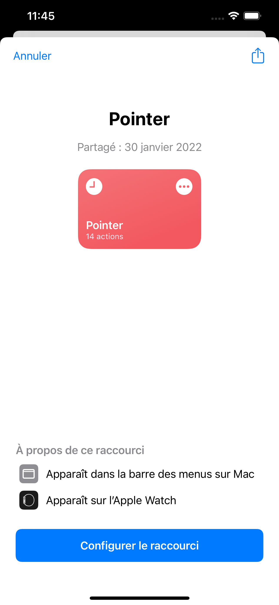

# Welcome to clocking-shortcut 👋

> Shortcuts to clock in and out at UHA 4.0

## Automation:

## Installation:

1. Open the first shortcut on apple device and click on configure:
   
   

2. Configure the mail and your password. 
   ⚠️ The password is not crypted, so don't reuse this password elsewhere !!!
   
   
   
3. Start over with the other shortcut.

4. You're done !
   
   

## Author

👤 **Robin RULLO**

* Github: [@robinrullo](https://github.com/robinrullo)

## Show your support

Give a ⭐️ if this project helped you!

***
_This README was generated with ❤️ by [readme-md-generator](https://github.com/kefranabg/readme-md-generator)_